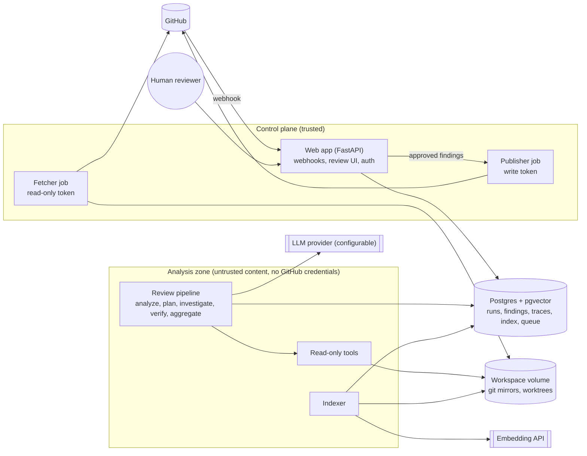
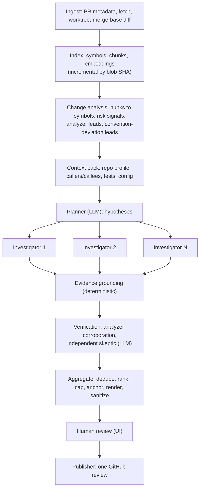

# Architecture

> **Status: proposed design, under review (2026-10-03). Nothing here is implemented yet.**
> **Constraint:** no budget for paid API calls. Development and evaluation run on free model tiers, behind a provider-neutral LLM interface (D2, D3).
> `D<n>` references point to the decision register in [decisions.md](decisions.md). "Proposed" decisions are waiting for sign-off. "Open" decisions need input before the relevant phase.

Related documents:

- [security.md](security.md): threat model and mitigations
- [evaluation.md](evaluation.md): testing and evaluation methodology
- [implementation-plan.md](implementation-plan.md): phases
- [research.md](research.md): prior art and sources

## 1. Goals and non-goals

**Goals**

- Review a GitHub pull request and report a small number of **high-precision, evidence-backed findings**: bugs, security issues and other problems with real impact.
- Investigate beyond the diff: callers, callees, validation, tests, configuration and history.
- Make every finding auditable. Each one links its claim to evidence (exact line ranges at the analyzed commit), then to a verification result, then to the full investigation trace.
- Keep a human in control. Nothing is posted to GitHub without explicit approval.
- Be measurable. An evaluation harness reports precision, recall, false-positive rate and cost, and ablations justify each agentic or retrieval component.

**Non-goals (for now)**

- Style, formatting, naming or lint-level comments. Linters do this better.
- Approving or blocking PRs, or pushing commits. Fix *suggestions* are in scope. Autofix is a stretch goal.
- Deep support for many languages at once. Python comes first (D18).
- A general "chat with your codebase" feature.
- Multi-tenant SaaS scale. The design is production-shaped but sized for a handful of repositories.

## 2. Design principles

1. **Evidence before claims.** A finding can only be reported if its evidence points to code the agent actually saw through a tool during the investigation. The system checks this mechanically (§4.8).
2. **Investigate, verify, then ask a human.** Generating a claim is cheap. A false positive costs reviewer trust. Every stage may answer "refuted" or "inconclusive".
3. **Deterministic where possible, LLM where necessary.** Parsing, indexing, diff mapping, evidence validation, anchoring, rendering and publishing are ordinary code. The LLM decides what to investigate and judges what it finds.
4. **Treat all repository input as untrusted.** Code, comments, docs, PR text, commit messages and agent instruction files inside the repository are attacker-controllable data ([security.md](security.md)).
5. **Capability-poor agent.** The analysis agent can only read. It cannot write, execute repository code, reach the network or see credentials. Publishing is a separate component behind human approval.
6. **Agentic only where it pays.** Every non-trivial component (planner, parallel investigators, verifier, semantic retrieval) has an ablation in the eval suite. A component that doesn't improve the numbers is removed.

## 3. System overview



| Component | Responsibility | Trust zone |
|---|---|---|
| Web app (FastAPI) | GitHub webhooks, review UI, reviewer auth, run management | Control plane |
| Fetcher (job) | Mints a read-only installation token and fetches the repository into the workspace volume | Control plane |
| Publisher (job) | Mints a write token and posts approved findings as one GitHub review | Control plane |
| Analysis worker | Indexes the repository, then analyzes, plans, investigates, verifies and aggregates | Analysis zone: handles untrusted content and holds no GitHub credentials |
| Postgres + pgvector | Runs, findings, evidence, traces, decisions, code index, embeddings, job queue | Shared, with a separate database role per zone |
| Workspace volume | Bare mirrors and per-run worktrees | Written by the fetcher, read by the worker |
| CLI (`pri`) | Local reviews, evals, maintenance | Developer machine |
| Eval harness | Datasets, runner, matcher, metrics, reports | Developer machine or CI |
| Sandbox (stretch S1) | Runs generated tests against the PR | Isolated: no network, no secrets |

During local development (Phases 1–5) everything runs in one process with a personal access token. The zone separation arrives with the GitHub App service in Phase 6.

## 4. The review pipeline

A run reviews one PR at one head commit. Each stage persists its output (`stage_result`), so a failed run resumes from the last completed stage and each stage can be evaluated on its own.



### 4.1 Trigger and admission

- **Triggers.** A run starts from the `pull_request` webhook (`opened`, `synchronize`, `reopened`, `ready_for_review`), a manual re-run in the UI, or the CLI. Draft PRs are skipped by default.
- **One active run per PR.** A push with a new head SHA supersedes any queued or running run for the same PR. Cancellation is cooperative and happens between stages and investigations.
- **Admission policy.** Repositories must be allowlisted, each installation has a daily budget, and PR size is limited. A PR over the size limit (initially about 2,000 changed lines or 60 files) gets a partial review of its highest-risk files. The review summary then lists exactly which files were not reviewed.
- **Repository config comes from the base branch.** The `.pr-investigator.yml` file (ignore paths, focus areas, severity threshold, comment cap) is read from the base branch, never from the PR head (D16). The same rule applies to any repository signal that reduces review coverage, such as `linguist-generated` attributes.

### 4.2 Ingest and workspace

- **Metadata.** Title, body, author, base and head SHAs, and the file list come from the REST API.
- **Workspace.** The fetcher keeps one bare mirror per repository and fetches `refs/pull/<n>/head`, so fork PRs work. It then creates a detached worktree at the head commit. The base side is read from git objects, or from a second worktree created only when needed.
- **Hardened git.** Hooks are disabled, submodules aren't recursed, LFS smudge filters are off, and protocol and size limits apply. Nothing in the repository is ever executed.
- **Diff and commentable lines.** The diff is computed locally against the merge base, which is what GitHub shows for a PR. It is parsed into hunks and turned into a map of **commentable lines** per file and side. GitHub only accepts review comments on lines inside diff hunks, so this map gates anchoring later.

### 4.3 Indexing (incremental)

Indexing is content-addressed by git blob SHA (details in §6.2). Parse results, chunks and embeddings for a given file version are computed once and reused across commits and PRs. Once the base branch is indexed, indexing a PR head only touches the blobs the PR changed. The first index of a repository is the only expensive one.

### 4.4 Change analysis and leads (deterministic)

This stage produces a `ChangeSet`:

- **Hunk mapping.** Each hunk is mapped to its enclosing symbols in head and base and classified: new function, modified body, signature change, deletion, config, dependency manifest, migration, CI workflow, test or agent instruction file.
- **Risk signals.** These flag:
  - changed code that touches security-sensitive APIs (SQL execution, subprocesses, deserialization, file paths, outbound HTTP, templating, crypto, auth decorators)
  - deleted guard conditions
  - changed error handling
  - signature changes whose callers weren't updated
  - bidirectional-control or invisible Unicode characters
- **Analyzer leads.** Semgrep or Opengrep (D12) runs on the base and head versions of each changed file. Only alerts that are new in head are kept.
- **Convention-deviation leads** (§6.4). These flag checks that similar neighbouring functions perform consistently but the changed function does not.

Leads are suspicions, not findings. The planner must either turn each lead into a hypothesis or dismiss it with a reason, so nothing is dropped silently.

### 4.5 Context pack (deterministic)

The context pack is a compact briefing shared by the planner and all investigators, budgeted to roughly 8–12k tokens. It contains:

- **Repository profile.** Detected languages and frameworks, entry points (routes, CLI commands), database layer, auth conventions and test framework, all computed deterministically and cached per snapshot.
- **PR intent.** The title and description, explicitly **marked as untrusted**, plus the changed files with line counts.
- **The diff,** with line numbers.
- **Per changed symbol:** its signature, docstring, top callers, callees defined in the repository, related tests and related config keys.
- **Signals and leads** from the `ChangeSet`.

The pack carries signatures and locations, not whole files. The agent fetches bodies on demand. Because the pack is byte-identical across investigators, it works as a cacheable prompt prefix (§7).

### 4.6 Planning (one LLM call, structured output)

The planner receives the context pack, a review checklist per category, and the repository's focus areas. In Phase 2 it receives only the PR metadata and the diff; the context pack and leads arrive in Phase 3. Its output is a schema-constrained JSON object, validated into typed models (§7.1). It contains:

- one paragraph describing what the PR is trying to do
- up to *K* (initially 4, D25) **hypotheses**, each with:
  - a category
  - an anchored location in the changed code
  - the suspected problem and why it is plausible
  - *the evidence that would confirm or refute it*
  - a priority and links to related leads
- dismissed leads, each with a reason

**Why a separate planner** rather than one agent exploring the whole PR:

- Hypotheses can be investigated in parallel, each with its own budget and a clean context.
- They are visible in the UI, including the refuted ones ("we checked X; it's fine because Y").
- They allow per-stage evaluation: planner recall separately from investigator precision.

The single-agent alternative is kept as ablation A1 ([evaluation.md](evaluation.md)).

### 4.7 Investigation (the agent loop)

There is one investigator per hypothesis (or per cluster of hypotheses on the same lines), each in a fresh conversation.

- **Prompt layout**, ordered from stable to volatile so the prefix caches well: tool definitions, then the system prompt (role, evidence rules, injection policy, output protocol), then the context pack, then the hypothesis and its budget.
- **Loop** (D4). The harness calls the model through the LLM interface (§7.1) and runs every requested tool call. The tools are read-only and therefore parallel-safe, so they run concurrently and all results go back together in one message. This repeats until the model calls `submit_verdict` or a budget runs out. History is append-only: earlier turns are never edited. That keeps prompt caches valid where a provider has them, and satisfies providers that only accept replayed reasoning in unedited conversations.
- **Budgets** (D25). Initially at most 6 model turns per suspect. The harness also caps tool calls per turn and the size of each tool result, which bounds the tokens in each request, and it enforces a wall-clock timeout. Before the last turn, it tells the model to submit what it has, using `inconclusive` if the evidence is incomplete. A provider's native pacing feature (such as Claude's task budgets) can be used on top, never instead.
- **Termination.** The prompt asks for `submit_verdict`. The harness doesn't rely on forcing a tool call, because not every provider supports it (current Claude models reject it). If a conversation ends without a verdict, the harness asks once more. After that it records the hypothesis as `inconclusive (no verdict)`. Verdict arguments are validated against the schema like any structured output.
- **Stop reasons.** Adapters normalize each provider's stop reasons. Security discussions can trip a provider's safety filters. A `refused` stop is recorded and the hypothesis is marked as not investigated. The harness never rephrases a prompt to get around a refusal. When `max_tokens` cuts off a pending tool call, the input is discarded and the turn is retried with more room.
- **Concurrency.** Phase 2 runs investigations one at a time. On the free tier, the rate limit, not concurrency, sets the pace, and sequential runs keep traces and replays simple. Parallel investigators, and the prompt-cache warm-up they would need, can come later if wall-clock time matters.

Verdict schema (`submit_verdict`):

| Field | Meaning |
|---|---|
| `status` | `confirmed`, `refuted` or `inconclusive` |
| `claim` | One-sentence statement of the problem |
| `explanation` | Short markdown covering impact and trigger conditions |
| `category`, `severity` | Values from fixed enums. Severity follows a written rubric. |
| `confidence` | `high`, `medium` or `low`, with a rationale. Treated as a weak signal (§4.10). |
| `evidence[]` | References to observations (§4.8), each with a role and a note |
| `flow[]` | For data-flow issues: the ordered path from source through transformations to sink, each step an evidence reference |
| `counter_evidence` | What would make this a false positive, and why it doesn't apply |
| `suggested_fix` | Optional: prose and/or a replacement for the anchored lines |
| `anchor` | File and line range in the diff where the comment should go |

### 4.8 Evidence model and grounding (deterministic)

This is the core mechanism against hallucinated findings.

- **The observation ledger.** Every tool call that returns repository content records **observations** in a ledger scoped to the investigation: `(observation_id, tool, path, ref [head|base], start_line, end_line, content_hash)`. A search records one observation per match. A search with no matches records an observation of the query, its scope and the empty result.
- **Evidence is a reference, not text.** Each evidence item in a verdict names an `observation_id`, the path, a line sub-range and a role: `defect_site`, `source`, `sink`, `missing_guard`, `caller`, `test`, `config`, `search_negative` and so on.
- **Validation.** An evidence item is rejected if its observation doesn't exist, if its line range isn't contained in what was observed, or if the content hash no longer matches the file at the analyzed commit.
- **System-extracted snippets.** The snippets shown to the verifier and the human are **extracted from the repository by the system**, never copied from model text. A misquoted line can't reach a reviewer.
- **Requirements for a confirmed verdict.** It needs at least one valid `defect_site` evidence item and an anchor on a commentable line. An absence claim such as "no authorization check" needs positive evidence of the code path that was read, plus the searches that came back empty.

Grounding proves that the cited code exists and that the agent looked at it. It doesn't prove that the code means what the claim says. That is the verifier's job, and ultimately the human's.

### 4.9 Verification

The layers run from cheap to expensive:

1. **Grounding and structure.** Evidence grounding (§4.8), schema validity and anchor validity.
2. **Analyzer corroboration.** For categories with rule support, a targeted Semgrep/Opengrep rule, or an existing lead on the same lines, raises confidence. A missing alert doesn't refute anything, because the free analyzers' taint tracking is limited.
3. **Independent skeptic** (LLM, fresh context). The skeptic receives only the claim, the system-extracted evidence snippets, the relevant diff hunk and a small read-only tool budget (about 8 calls). It is asked to *refute* the claim: look for upstream validation, framework protections (such as ORM parameter binding), unreachable paths, type constraints, or tests showing the case is handled. It returns `upheld`, `refuted` or `uncertain`, with grounded refuting evidence. The separate context keeps it from anchoring on the investigator's reasoning.
4. **Execution** (stretch S1). Generate a minimal test that demonstrates the issue and run it in an isolated sandbox against head, and against base to confirm a regression. This is the strongest evidence available, and also the most expensive and risky to operate ([security.md](security.md) §5.2).

**Outcomes.**

- **Refuted with valid evidence:** dropped from the review, but kept in the trace and shown under "Refuted".
- **Uncertain:** kept with a lower rank.
- **Upheld:** kept.

The eval measures how many true positives the verifier removes, not only how many false positives.

### 4.10 Aggregation, ranking and rendering

- **Dedupe.** Findings with overlapping anchors and the same root cause are merged. A low-effort LLM call compares candidates on the same lines.
- **Rank.** Findings are ranked by severity × verification strength. The strength levels, weakest first: grounded, analyzer-corroborated, upheld by the skeptic, demonstrated by execution. Self-reported confidence is only a tie-breaker. Thresholds are calibrated on the eval set to hit a target precision.
- **Noise budget** (D17). By default at most 7 comments are posted, and only findings that are severity medium or higher and upheld by the verifier. Everything else stays visible in the UI as "not posted by default".
- **Anchoring.**
  - The comment goes on the diff lines that cause the problem.
  - If the defect shows up outside the diff (for example, a caller broken by a signature change), the comment goes on the changed line and links to the affected location.
  - If nothing in the diff is suitable, the finding moves to the review summary.
- **Rendering.**
  - Comments are rendered from structured fields through a fixed template: title, severity, explanation, evidence as permalinks to the analyzed commit, and an optional `suggestion` block.
  - A suggestion is included only when it replaces exactly the anchored lines and the patched file still parses.
  - Output is sanitized ([security.md](security.md) §5.4): no raw HTML, images, external links or live @-mentions. Outgoing text is scanned for secrets.

### 4.11 Human review

**The review UI shows, for each run:**

- the PR and the analyzed commit
- cost and duration
- how many hypotheses were confirmed, refuted or left inconclusive

**For each finding it shows:**

- the claim and severity
- verification badges
- evidence snippets with links
- the skeptic's notes
- the full investigation trace (tool calls and results)

**Reviewer actions:**

- approve
- edit (title, body, severity, suggestion)
- reject with a reason code: `false_positive`, `not_important`, `duplicate`, `wrong_location`, `unclear` or `other`

Decisions are stored and become labelled data for evaluation and, later, for feedback memory (S4).

If the PR has new commits since the analysis, the UI says so and offers a re-run. Publishing still targets the analyzed commit.

### 4.12 Publishing

- **One review per publish.** The publisher makes a single `POST /repos/{owner}/{repo}/pulls/{number}/reviews` call:
  - `commit_id` set to the analyzed head SHA
  - `event` set to `COMMENT` (never `APPROVE` or `REQUEST_CHANGES` automatically)
  - a summary body with coverage notes
  - `comments[]` entries with `path`, `line` and `side`, plus `start_line`/`start_side` for ranges

  A single review produces one notification and stays clear of GitHub's secondary rate limits.
- **Idempotency.** Each publication has a key and a hidden marker in the review body. A retry first checks for an existing review carrying that marker.
- **Rejected lines.** If GitHub rejects a line with a 422, that finding moves into the summary body. The rest of the publish still succeeds.
- **Comment identity** (D15). Comments are posted by the GitHub App with "approved by @reviewer" in the footer (recommended), or by the reviewer through a user-to-server token.

## 5. Agent tools

Rules that apply to every tool:

- **Typed, read-only, no shell** (D6). Typed tools let the harness confine paths, record observations, bound output and show each call clearly in the trace. A shell would give the agent more freedom but give the harness only an opaque command string.
- **Confined to the worktree.** All paths resolve inside the run's worktree. Symlinks pointing outside are refused, as are binary and oversized files.
- **Bounded, predictable output.** Results are line-numbered and deterministically ordered, bounded (for example, at most 400 lines or about 8k tokens), and state when they were truncated and how to page.
- **Errors** come back as error results with actionable messages. Tool inputs are validated against their schemas before a tool runs, with strict schema mode used where the provider supports it.
- **Descriptions say *when* to use a tool,** not just what it does.

| Tool | Purpose | Backed by | Phase |
|---|---|---|---|
| `get_diff(path?)` | The PR diff with old and new line numbers | Local diff | 1 |
| `read_file(path, start, end, ref)` | Read a line range from head or base | Worktree / git objects | 1 |
| `search_code(pattern, mode, glob, context, ref)` | Literal or regex search | ripgrep (`--json`) | 1 |
| `list_directory(path)` | Bounded tree listing | Worktree | 1 |
| `submit_verdict(...)` | Terminal tool that returns the structured verdict | — | 2 |
| `report_findings(...)` | Terminal tool for the single-agent reviewer (A1): up to 4 findings, each with evidence | — | 2 |
| `find_symbol(name, kind?)` | Where is X defined? | Symbol index | 3 |
| `find_references(symbol)` | Call sites and usages. Results say whether they're name-based or precise. | Reference index (LSP in S2) | 3 |
| `get_symbol_context(path, line)` | Enclosing function or class, signature, decorators, direct callers and callees | Symbol index | 3 |
| `find_tests(path or symbol)` | Tests that exercise a module or symbol | Imports, naming conventions, semantic search | 3 |
| `semantic_search(query, scope, k)` | Find code by behaviour when names are unknown | Hybrid retrieval (§6.3) | 3 |
| `git_history(path, lines)` | Recent commits touching a region, with messages | `git log -L` | 3 |
| `structural_search(pattern, lang)` | AST pattern search (optional) | ast-grep | 3 (optional) |
| `run_test(...)` | Run a generated test | Sandbox | S1 |

About a dozen tools is small enough to keep in context, so no tool search is needed.

## 6. Repository intelligence and retrieval

### 6.1 Which retrieval answers which question

| Question | Retrieval | Why |
|---|---|---|
| Where is X defined? Who calls it? What does it import? | Structural index | Precise and cheap. Embeddings are the wrong tool here. |
| Where does this exact identifier, string or config key appear? | Lexical (ripgrep) | Exact, and always fresh |
| Is there an existing sanitizer or helper for this? How do other handlers enforce auth? Which tests cover this behaviour? | Semantic and lexical, fused | The relevant names aren't known in advance |
| Why does this code look like this? Was it a past fix? | Git history | Commit messages and earlier fixes are evidence |
| Have maintainers rejected this kind of finding before? (S4) | Retrieval over past review decisions | Calibrates against this repository's own feedback |

Recent studies found that agents with good grep tools match or beat embedding retrieval on many coding tasks, and that embedding models lose much of their accuracy on repository-level retrieval ([research.md](research.md) §4). So semantic retrieval is used only where names are unknown, and its value is measured by ablation rather than assumed.

### 6.2 Indexing

- **Parsing.** tree-sitter, through a prebuilt language pack: fast, error-tolerant (PR code may not compile), and one API for many languages.
  - Python gets deep support: imports, decorators, call sites and framework idioms.
  - Other languages get generic definitions and references from tags queries, so the agent can still navigate them.
- **Extracted per blob:**
  - symbols (kind, qualified name, line range, signature, docstring, decorators, parent)
  - imports
  - call sites (callee text and line)
- **References.** Resolved by name and narrowed by import analysis (for example `from a.b import c`). This is imprecise for dynamic code and common names, so results are labelled "candidate references". Precise LSP-backed references are stretch S2.
- **Chunking.** AST-aware, in the style of cAST:
  - functions, classes and methods are the units
  - large nodes are split along child boundaries, and small siblings are merged up to a size limit
  - each chunk gets a header with its path, the enclosing class or function signature, and the first docstring line
- **Content addressing.** Symbols and chunks are keyed by `(blob_sha, parser_version)`, and vectors by `(chunk_text_sha, embedding_model)`. A commit snapshot is just a map from path to blob SHA. The index therefore always matches the exact commit under review, and embeddings can't go stale.
- **Exclusions.** Vendored, generated, minified, lockfile, binary and oversized files are skipped. Exclusion rules come from the base branch only.

### 6.3 Semantic retrieval

- **What is embedded.** Code chunks and docs (README, `docs/`, SECURITY.md, CONTRIBUTING), stored in pgvector with an HNSW index. The embedding model is D9, decided in Phase 3: a local open-weight model is recommended because it's free, with a free embedding API as the alternative.
- **Hybrid query.** A vector similarity search and a Postgres full-text search run separately and are merged with Reciprocal Rank Fusion: `score(d) = Σ 1 / (k + rank_i(d))`, with `k ≈ 60`. The full-text search uses identifier-aware tokenization that splits snake_case and camelCase. Scores from different retrievers aren't comparable, but ranks are.
- **Filters.** Scope (code, tests, docs), path prefix, language and symbol kind.
- **Isolation.** Embeddings are never shared across installations ([security.md](security.md) §5.8).

### 6.4 Convention-deviation leads

This is the main use of retrieval inside the deterministic pipeline. For each new or modified function:

1. Retrieve its *k* nearest neighbours: similar functions in the same repository, preferring the same module or decorator family.
2. Compare structural features from the symbol index: decorators, calls to guards and validators, exception handling, transactions or locks, and logging of security events.
3. If a feature appears in most neighbours (for example, at least 70% of at least 5) but not in the changed function, emit a lead such as *"9 of 9 sibling route handlers call `require_permission()`; `export_report()` does not."*

The investigator then checks whether the deviation matters; perhaps middleware enforces auth globally. This catches problems that are invisible in the diff and have no single wrong line, such as missing checks. It is specific to this repository's conventions rather than generic advice. The eval measures whether embedding neighbours beat simple structural neighbours (same file or decorator).

### 6.5 Deliberately out of scope

- chat over the codebase
- RAG over the diff itself (the diff is always in context)
- whole-repository LLM summaries generated up front (expensive, quick to go stale, and unverifiable)

## 7. LLM usage

**Constraint (D3, D21): development and evaluation use free API tiers only.** There are no paid calls and no paid routing. The design therefore must not depend on any one provider's features.

### 7.1 The LLM interface

The pipeline talks to one small internal interface, never to a vendor SDK (D2, D24).

- **Call:** `LLMClient.generate(request) -> response`, asynchronous.
- **Request:**
  - system prompt
  - messages (user, assistant, tool results)
  - optional tool specs (name, description, JSON schema)
  - optional output schema (a Pydantic model)
  - max output tokens
  - a reasoning-effort hint (`low`, `medium`, `high`) that each adapter maps to its provider's setting or ignores
- **Response:**
  - text
  - the validated output object, when a schema was given
  - tool calls
  - a normalized stop reason: `end`, `tool_use`, `max_tokens`, `refused` or `error`
  - token usage
  - provider and model IDs
  - the raw payload, for the trace
- **Capabilities.** Each adapter declares what its provider supports: native structured output, tool calling, parallel tool calls, prompt caching, context window, and whether the provider may train on submitted data.

Rules that keep the pipeline provider-neutral:

- **Structured output always comes back validated.** If a provider can't enforce a schema natively, the adapter asks for JSON, validates it with Pydantic and retries once with the validation error. The pipeline sees either a valid object or a typed failure.
- **Budgets are enforced by the harness** (turns, tool calls, tokens, wall-clock time). They are never delegated to a provider feature.
- **Provider extras are optional.** Features such as prompt caching are used when an adapter declares them, and the pipeline works without them.
- **Conversations are append-only** with every provider. That's the simplest model to reason about, and some providers' caching and reasoning rules require it.

| Adapter | Covers | When |
|---|---|---|
| `fake` | Scripted responses for tests | Phase 1 |
| `replay` | Recorded real responses, keyed by a hash of the request. It doubles as a local response cache, so re-running an eval doesn't spend quota again. | Phase 1 |
| `gemini` | Google Gemini API, through the native `google-genai` SDK | Phase 1 default |
| `openai_compatible` | One adapter for every OpenAI-compatible endpoint: Groq, OpenRouter, local Ollama, GitHub Models, OpenAI | When needed |
| `anthropic` | Claude, including its prompt caching, task budgets and refusal fallback | When a budget exists |

The provider and model are configuration: `PRI_LLM_PROVIDER`, `PRI_LLM_MODEL`, and optional per-stage overrides in the config file. There is no routing layer, no automatic fallback between providers, and no extra infrastructure. Adapters are plain Python modules.

### 7.2 Phase 1 provider

The provider (D3) is the **Gemini API free tier with a Gemini Flash model**. The evaluation model is `gemini-3.5-flash-lite`: the official B0 baseline used it, and Phase 2 comparisons must use it too. `gemini-3.8-flash` stays the code default but returned "high demand" and rate-limit errors on the free tier. Google shows each project's free-tier limits in AI Studio rather than publishing them. It's the only free option whose per-minute token allowance and context window fit a whole diff plus context in a single request:

- Groq's free tier allows about 6–8k tokens per minute.
- GitHub Models caps input at about 8k tokens per request.
- OpenRouter's free models allow 50 requests a day without purchased credits.

Details and sources are in [research.md](research.md) §9.

Zero-spend guards:

- **No billing account.** The API key comes from a project with no billing attached, so going over quota returns HTTP 429 errors instead of charges.
- **Paid providers off by default.** `PRI_ALLOW_PAID_PROVIDERS` defaults to false, and paid-provider adapters refuse to run while it is.
- **Request caps.** Every eval run has a request cap.
- **Data-use limits.** Gemini's free tier, like some others, may use submitted data to improve the provider's products. Providers like that are only used on public repositories and our own fixtures ([security.md](security.md) §5.8).

### 7.3 Stages

| Stage | Call shape | Effort hint | Output |
|---|---|---|---|
| Baseline reviewer (B0, B1) | Single call | medium | Structured output |
| Planner | Single call | medium | Structured output |
| Investigator | Tool loop | medium | `submit_verdict` tool call |
| Skeptic verifier | Short tool loop | high | Structured output |
| Dedupe and summary | Single call | low | Structured output |
| Eval judge | Single call | low | Structured output |

Phase 2 keeps every call at medium effort, the same as B0, so comparisons with the baseline measure the investigation rather than extra reasoning.

### 7.4 Usage estimates

Free tiers are limited by requests and tokens per minute and per day, not by money.

- **Baseline (Phase 1).** One request per PR. Ten cases × 3 repetitions is about 30 requests, plus judge calls. That fits comfortably in a day's free quota.
- **Agentic reviewers (Phase 2).** With the D25 budget, A2 makes at most about 26 requests per PR: one planner call (plus one possible repair) and up to 4 suspects × 6 turns. A1 makes at most 12. This project's free tier for `gemini-3.5-flash-lite` allows 15 requests/min, 250K tokens/min and 500 requests/day:
  - One 10-case A2 eval run is at most about 260 requests, and A1 at most about 120, so both fit in one day's quota with little room for anything else.
  - Running at 10 requests/min, below the limit of 15, with capped tool output keeps the worst case under the tokens-per-minute limit.
  - A full A2 run takes roughly 15–30 minutes.

  Mitigations: the replay cache (re-scoring is free), a request cap on every run, and developing against the scripted fake provider rather than the live API.
- **On a paid provider later.** At Claude Opus 5.5 list prices, a full review would cost roughly $3–5 per PR at high effort.

Free-tier limits change often and aren't guaranteed. Check the provider's console before relying on any number here.

### 7.5 Prompts and reproducibility

Prompts are versioned template files. Each run records the provider, model IDs, effort hints, prompt versions, tool versions and index versions. Free-tier models change without notice, so results always name the exact model ID that produced them.

## 8. GitHub integration

- **GitHub App** (D14), rather than a personal token, an OAuth App or a GitHub Action. It gives fine-grained permissions, short-lived installation tokens, webhooks and a bot identity. A personal token (`gh auth token`) is supported only for local development.
- **Permissions.** Metadata (read), Contents (read), Pull requests (read and write). Optionally Checks (write), for a status check that links to the review UI.
- **Events.** `pull_request`, plus installation lifecycle events.
- **Auth flow.**
  1. Sign a JWT (RS256, expiring in at most 10 minutes) with the App's private key.
  2. Exchange it for an installation token, which lasts 1 hour. Each job gets a token **down-scoped** to one repository and the minimum permissions: `contents:read` for the fetcher, `pull_requests:write` for the publisher.

  Tokens are never logged and never reach the analysis worker.
- **Webhooks.**
  1. Verify `X-Hub-Signature-256` (HMAC-SHA256 over the raw body, with a constant-time compare) before parsing.
  2. Dedupe on `X-GitHub-Delivery`. Redeliveries reuse the same ID.
  3. Persist the delivery, enqueue a job and return a 2xx well within GitHub's 10-second limit. All real work happens in the worker.
- **Reviewer login.** GitHub user authorization through the App's OAuth web flow. Access requires write permission on the repository, checked through the API. A single-user token mode exists for local use.
- **Local webhook development.** smee.io forwarding.
- **Library.** Phase 1 uses httpx for its single REST endpoint. githubkit (typed, async, GitHub App auth helpers) comes with GitHub App auth (D22).

## 9. Data model

From Phase 3, everything lives in Postgres (D10). Phase 1 writes each run as JSON files under `.pri/runs/`. Domain objects are typed models in code. JSONB holds stage outputs and verdicts, whose shape evolves quickly.

| Table | Key contents | Notes |
|---|---|---|
| `installation` | GitHub installation id, account, status | Lifecycle driven by webhooks |
| `repository` | Installation, GitHub id, full name, default branch, enabled flag, settings | |
| `pull_request` | Repository, number, title, author, latest head SHA, state | Metadata cache |
| `analysis_run` | PR; base, head and merge-base SHAs; trigger; status; current stage; resolved config; model and prompt versions; cost and token totals; timings; error | Status: queued → running → awaiting_review → published, or failed / superseded / cancelled |
| `stage_result` | Run, stage, status, output (JSONB), timings | Checkpoint and resume |
| `hypothesis` | Run, category, location, rationale, evidence needed, priority, source (planner, analyzer or convention), linked leads, status | |
| `investigation` | Hypothesis, status, verdict (JSONB), turns, tool calls, tokens, cost, stop reason | |
| `observation` | Investigation, tool, path, ref, line range, content hash | The evidence ledger |
| `trace_event` | Run, investigation, sequence number, kind, payload (JSONB, compressed when large) | LLM requests and responses, tool calls and results |
| `finding` | Run, hypothesis, category, severity, title, body, anchor (path, side, lines), suggestion, verification (JSONB), rank, status | pending_review → approved / rejected → published |
| `evidence` | Finding, role, path, ref, commit, line range, snippet, snippet hash, observation | Snippet extracted by the system |
| `review_decision` | Finding, reviewer, decision, edits, reason code and text, time | Labelled feedback |
| `publication` | Run, GitHub review id, comment ids, commit, posted by, payload, status | Idempotency |
| `webhook_delivery` | Delivery id (primary key), event, action, status | Dedupe |
| `index_snapshot`, `snapshot_file` | Repository and commit → path, blob SHA, language, flags | |
| `symbol`, `reference`, `chunk` | Keyed by blob SHA plus parser or chunker version | Content-addressed |
| `chunk_embedding` | Chunk text hash and model → vector | pgvector HNSW index, scoped per installation |
| Queue tables | | Managed by procrastinate |

Every row belongs to one installation, directly or through its parent, and every query is scoped by installation.

**Retention.**

- Worktrees are deleted after each run, and mirrors stay cached.
- Traces expire after a configurable period (for example, 30 days).
- Uninstalling the App deletes everything for that installation.

## 10. Observability and cost accounting

- **Traces.** `trace_event` rows are the primary observability tool *and* a product feature (the trace view). Every LLM call records provider, model, input and output tokens (plus cache tokens where the provider reports them), latency, effort hint, stop reason, and cost (zero on free tiers).
- **Rollups.** Run-level cost, latency and outcomes appear in the UI.
- **Logs.** Structured JSON logs carry run and investigation IDs. Secrets and tokens are never logged.
- **Optional export** (S8). OpenTelemetry export using the GenAI semantic conventions, for example to Langfuse or Phoenix.

## 11. Deployment

- **Container.** One image containing the Python app plus git, ripgrep, Semgrep/Opengrep and optionally ast-grep, with `web`, `worker` and `cli` entrypoints, alongside Postgres with pgvector.
- **Local.** Docker Compose runs Postgres, the web app and the worker. CLI-only mode needs just Postgres.
- **Hosted demo** (D20). The recommendation is a single small VM running Compose behind Caddy for TLS: cheap, and it leaves room for gVisor if S1 happens. A PaaS with managed Postgres is the lower-ops alternative. The App is installed only on allowlisted repositories to cap spend.
- **CI** (GitHub Actions). Lint, type check, unit and integration tests (with a Postgres service container), replay-based agent tests, and an image build. Live evals run only through manual dispatch on trusted branches with a budget cap, never on fork PRs.
- **Secrets.** Kept in the environment or a secret manager. The App private key is mounted as a file. Nothing secret goes into the image.

## 12. Technology stack

| Concern | Proposed choice | Why | Main alternatives |
|---|---|---|---|
| Language | Python 3.13 (D1) | Strongest ecosystem for LLM, retrieval and eval work; official SDKs from every major LLM provider; tree-sitter bindings; one language for agent, service and evals | TypeScript: best GitHub App tooling (Octokit, Probot) and one language with a React UI |
| Tooling | uv, ruff, mypy (strict), pytest with Hypothesis (D22) | Fast and widely used | pyright or ty for type checking |
| LLM | A configurable provider behind a thin internal interface (D2, D24); the Gemini free tier for development (D3) | Free now; the pipeline stays provider-neutral; moving to Claude or OpenAI means adding an adapter | LiteLLM or PydanticAI as the abstraction |
| Orchestration | Thin custom orchestrator on the LLM interface (D4) | Works with any adapter; full control over budgets, the evidence ledger, tracing and replay, in a few hundred lines | Vendor tool runners, Claude Agent SDK, LangGraph, PydanticAI |
| Web and UI | FastAPI, Jinja2, HTMX (D13) | Async and Pydantic-native; a server-rendered UI with no JavaScript build step | A React/Vite SPA |
| GitHub client | httpx now; githubkit with GitHub App auth (D22) | One endpoint in Phase 1; typed, async App auth later | PyGithub |
| Parsing | tree-sitter with a prebuilt language pack | Fast, error-tolerant, multi-language, queryable | Python `ast` (Python-only, fails on syntax errors), LSP/SCIP |
| Lexical search | ripgrep | Fast, respects ignore files, linear-time regex engine (agent-supplied patterns can't cause catastrophic backtracking), JSON output | `git grep` |
| Static analysis | Semgrep CE or Opengrep (D12) | Runs locally without building the code; pattern and taint rules; JSON/SARIF output | CodeQL: deeper dataflow, but heavy and licence-restricted for non-open-source code |
| Storage | Postgres with pgvector (D10) | One store for relational data, vectors, full-text search and the queue | SQLite with sqlite-vec; a dedicated vector database |
| Queue | procrastinate (D11) | Postgres-backed, async, retries, queueing locks | arq or RQ (Redis), Celery, Temporal or DBOS |
| ORM and migrations | SQLAlchemy 2, Alembic | Standard | SQLModel, raw SQL |
| Embeddings | A local open-weight model, decided in Phase 3 (D9) | Free, and code stays on your machine | A free embedding API; Voyage's code model (paid) |
| CLI | Typer | Small, typed | Click |
| Packaging and deploy | Docker, Compose, Caddy | Simple, portable | A PaaS |

## 13. Repository structure

As of Phase 1. Modules are flat until they grow. Later phases add `agent/`, `indexing/`, `retrieval/`, `analyzers/`, `storage/`, `security/`, `web/` and `docker/`.

```text
pr-investigator/
├── CLAUDE.md
├── README.md
├── pyproject.toml            # uv-managed; ruff, mypy and pytest configuration
├── uv.lock
├── .env.example              # GEMINI_API_KEY etc.; copy to .env (gitignored)
├── .github/workflows/ci.yml  # lint, types, tests; no secrets, no live API calls
├── src/pr_investigator/
│   ├── cli.py                # `pri` review | eval list/validate/run | doctor
│   ├── config.py             # settings from env and .env
│   ├── domain.py             # ReviewTarget, Finding, Anchor, enums
│   ├── diff.py               # diff parser, commentable lines, line-numbered rendering
│   ├── workspace.py          # hardened git: mirrors, worktrees, merge base, diff
│   ├── github.py             # PR references, PR metadata over REST
│   ├── ingest.py             # ReviewTarget + Workspace from a GitHub PR or local refs
│   ├── tools/                # read-only tools and path confinement
│   ├── llm/                  # LLMClient, types, Gemini/fake adapters, cache, guards, factory
│   ├── prompts/              # versioned prompt files (baseline_review.v1.md, judge.v1.md)
│   ├── review/               # baseline reviewer (B0) and run reports
│   └── evaluation/           # cases, materialization, matching, metrics, runner
├── evals/
│   ├── fixtures/             # base projects the cases change (inventory_service)
│   ├── cases/                # case manifests (YAML)
│   └── results/              # committed summary reports
├── tests/                    # unit/, integration/, live/ (opt-in), support.py
└── docs/
```

## 14. Tradeoffs and simpler alternatives

| Choice | Cost | Why it's worth it | How it's tested or kept honest |
|---|---|---|---|
| **Agentic pipeline vs. one well-contextualized LLM call** | The agent costs more (dollars, not cents), is slower (minutes) and is less predictable. | A single call can't follow a value across files. | Baselines B0 and B1 stay in the eval, so the cost of agency is always visible. |
| **Planner + investigators vs. one agent loop** | The planner adds a call and a failure point: a hypothesis it misses is never investigated. Cursor reported gains from moving Bugbot to a single agentic loop. | Parallelism, clean contexts, visible refuted hypotheses, per-stage metrics | Ablation A1 |
| **Separate verifier vs. trusting the investigator** | Extra cost and latency, and it can remove true positives | Fewer false positives | Measured in both directions |
| **Typed tools vs. a shell in a sandbox (CodeRabbit-style)** | A shell is more flexible (pipes, ad-hoc scripts) and needs less tool code. | Typed tools are safer, auditable, and make the evidence ledger possible. | — |
| **Embeddings vs. grep only** | Embeddings add infrastructure, cost and an ingestion step, and research suggests grep often suffices. | Finds code by behaviour when names are unknown | Semantic retrieval is used narrowly, measured, and easy to drop. |
| **Heuristic references vs. LSP/SCIP** | Heuristics are imprecise. | Fast and language-generic. LSP is precise but heavier, and for some languages it runs build logic. | Start heuristic and label the imprecision. Add LSP (S2) if evals show reference errors matter. |
| **GitHub App vs. GitHub Action** | The App means hosting a service. | An Action needs no server, but human review needs an external UI anyway, secrets on fork PRs are a classic footgun, and every repository needs a workflow file. The App centralizes control. | — |
| **Postgres for everything vs. specialized stores** | Not the fastest vector search at large scale, which this project doesn't need. | Simpler operations and transactional consistency | — |
| **Custom orchestration vs. a framework** | More code to own | Budgets, evidence and replay are explicit and easy to explain. Frameworks shine with long-lived graphs and mid-run human interrupts, but human review here happens after the run. | — |
| **Own thin LLM interface vs. LiteLLM or a framework** | We write and maintain the adapters (each a small module), and provider-specific features are only available where an adapter exposes them. | Small and explainable, with no heavy dependency. Free development now, paid Claude later, without touching the pipeline. | Every adapter passes the same contract tests against fake and recorded responses. |
| **Managed Agents (Anthropic-hosted loop and sandbox)** | Less control over tool shapes and evidence semantics, and repository code goes into hosted containers. | Less infrastructure and a built-in sandbox | A reasonable alternative if execution-based verification becomes central |
| **Precision-first comment policy** | May hide real issues | Protects reviewer trust | Unposted findings stay visible in the UI, and the cap is configurable. |

## 15. Open questions

See [decisions.md](decisions.md) for the full register. Items still marked Open need a decision before the phase that depends on them.
